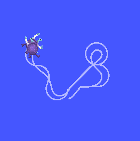
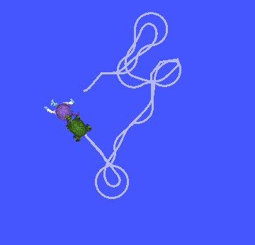
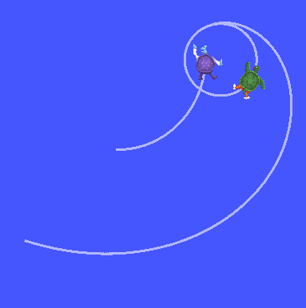

# Docs

You can view our documentation to install environment and understand the code in our upload files. [click here]()

# Run

### For ntf :

In one terminal

```shell
cd src/ntf/
source /opt/ros/dashing/setup.sh
colcon build
source install/setup.sh 
ros2 launch ntf ntf.py
```

In another terminal, open a package that controls the turtle. You may have to install this package yourself.

```shell
ros2 run teleop_twist_keyboard teleop_twist_keyboard cmd_vel:=/turtle1/cmd_vel
```



## For tf :

In one terminal

```shell
cd src/tf/
source /opt/ros/dashing/setup.sh 
colcon build
source install/setup.sh 
ros2 launch tf tf.py
```

In another terminal, open a package that controls the turtle. You may have to install this package yourself.

```shell
ros2 run teleop_twist_keyboard teleop_twist_keyboard cmd_vel:=/turtle1/cmd_vel
```



### For circle :

In  terminal

```shell
cd src/circle/
source /opt/ros/dashing/setup.sh 
colcon build
source install/setup.sh 
ros2 launch circle circle.py
```

