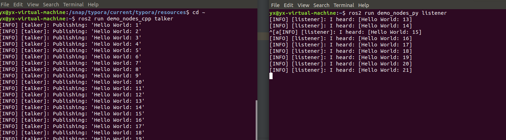

# 一、不使用坐标转换的方法（使用全局坐标）

本文代码基于CSDN博主代码开发， 原文链接：https://blog.csdn.net/weixin_43849505/article/details/120357533  。博文代码是ros1，我们目前使用的是ros2 dashing版本代码。The code different between ros1 and ros2 is still very big. In the ros2 version, there is a little different in the writing of launch files for dashing and serveral others , such as foxy and humble.  The current mainstream of launch files is turned to the configuration file represented by python instead of xml. **Our code is available and posted [here]()**

## 1. 环境搭建

### colcon 安装

```shell
sudo apt install python3-colcon-common-extensions
```

### ros2 dashing install

documentation address : [click here](https://docs.ros.org/en/dashing/index.html)

#### run the command below to install

```shell
#set locale
locale  # check for UTF-8
sudo apt update && sudo apt install locales
sudo locale-gen en_US en_US.UTF-8
sudo update-locale LC_ALL=en_US.UTF-8 LANG=en_US.UTF-8
export LANG=en_US.UTF-8
locale  # verify settings

#setup source 
sudo apt update && sudo apt install curl gnupg2 lsb-release
sudo curl -sSL https://raw.githubusercontent.com/ros/rosdistro/master/ros.key  -o /usr/share/keyrings/ros-archive-keyring.gpg
echo "deb [arch=$(dpkg --print-architecture) signed-by=/usr/share/keyrings/ros-archive-keyring.gpg] http://packages.ros.org/ros2/ubuntu $(lsb_release -cs) main" | sudo tee /etc/apt/sources.list.d/ros2.list > /dev/null

#install ros2 packages
sudo apt update
sudo apt install ros-dashing-desktop

sudo apt install -y python3-pip
pip3 install -U argcomplete
```

#### run demo

In one terminal, run the command below

```shell
source /opt/ros/dashing/setup.bash
ros2 run demo_nodes_cpp talker
```

In another terminal, run the command below

```shell
source /opt/ros/dashing/setup.bash
ros2 run demo_nodes_py listener
```

Get the following result:



## 2. Code

```c++
#include <rclcpp/rclcpp.hpp> // 这个头文件包含了ROS2的基本功能
#include <geometry_msgs/msg/twist.hpp> // 这个头文件包含了用于发布速度指令的消息类型
#include <turtlesim/msg/pose.hpp> // 这个头文件包含了乌龟的位姿消息类型
#include <math.h> // 这个头文件包含了数学函数和常数

// 定义全局变量来存储乌龟的位置和方向
double x, y, theta;
double nx, ny, ntheta;


// 这个函数用于更新第一个乌龟的位置和方向
void poseGet(const turtlesim::msg::Pose::SharedPtr msg)
{
    x = msg->x;
    y = msg->y;
    theta = msg->theta;
}

// 这个函数用于更新第二个乌龟的位置和方向
void selfPoseGet(const turtlesim::msg::Pose::SharedPtr msg)
{
    nx = msg->x;
    ny = msg->y;
    ntheta = msg->theta;
}

int main(int argc, char **argv)
{
    rclcpp::init(argc, argv); // 初始化ROS2
    auto node = rclcpp::Node::make_shared("nodes_handle"); // 创建一个节点

    // 创建订阅，当收到位姿信息时，就会更新乌龟的位置和方向
    auto pose_sub = node->create_subscription<turtlesim::msg::Pose>("/turtle1/pose", rclcpp::QoS(10), poseGet);
    auto self_pose_sub = node->create_subscription<turtlesim::msg::Pose>("/turtle2/pose", rclcpp::QoS(10), selfPoseGet);
    // 创建一个发布器，用于发布速度指令
    auto cmd_vel_pub = node->create_publisher<geometry_msgs::msg::Twist>("/turtle2/cmd_vel", rclcpp::QoS(10));

    // 设置循环的频率，这里是1000赫兹
    rclcpp::Rate loop_rate(1000);

    while (rclcpp::ok())
    {
        auto speed = std::make_shared<geometry_msgs::msg::Twist>(); // 创建一个新的速度指令
        double length = sqrt((nx - x) * (nx - x) + (ny - y) * (ny - y));// 计算两个乌龟之间的距离
        // 速度指令的初始值都是0
        speed->linear.x = 0;
        speed->linear.y = 0;
        speed->linear.z = 0;
        speed->angular.x = 0;
        speed->angular.y = 0;
        speed->angular.z = 0;

        if (length > 0.1) // 如果距离大于0.1，乌龟就开始移动
        {
            // 设置线速度，使乌龟向第一个乌龟移动
            speed->linear.x = 0.5 * length ;
            // 计算乌龟应该面向的方向
            double angle_to_target = atan2(y - ny, x - nx);
            if (angle_to_target < 0)
            {
                angle_to_target += 2 * M_PI; //  // 把角度限制在0到2π之间
            }
            // 计算乌龟当前的方向和应该面向的方向之间的差距
            double angle_diff = angle_to_target - ntheta;
            if (angle_diff > M_PI)
            {
                angle_diff -= 2 * M_PI; // 如果差距超过π，就让它减去2π，使差距保持在-π到π之间
            }
            else if (angle_diff < -M_PI)
            {
                angle_diff += 2 * M_PI; // 如果差距小于-π，就让它加上2π，使差距保持在-π到π之间
            }
            // 根据角度差距设置角速度
            speed->angular.z =  4 * angle_diff;
        }
        // 发布速度指令
        cmd_vel_pub->publish(*speed);
        // 处理一些ROS2的事件，如接收到的消息和服务请求
        rclcpp::spin_some(node);
        // 等待一段时间，使得循环频率达到设定的值
        loop_rate.sleep();
    }

    return 0;
}
```

### Supplementary explanation

In my opinion, the little turtle currently only provides six degrees of freedom for us to modify, which are the angular velocity and linear velocity of the x , y and x axes. Here we only use two degrees of freedom to control here, which are the linear velocity of x and y, or the linear velocity of x and angular velocity of z axis. Considering the orientation of the turtle's head, we use the linear velocity of the x-axis and the angular velocity of the z-axis to control the turtle's travel. However we keep the x-axis and y-axis speed to control the code that turtle 2 follows turtle 1.

### The code to use the x-axis and y-axis velocity is as follows

```c++
#include <rclcpp/rclcpp.hpp> // 这个头文件包含了ROS2的基本功能
#include <geometry_msgs/msg/twist.hpp> // 这个头文件包含了用于发布速度指令的消息类型
#include <turtlesim/msg/pose.hpp> // 这个头文件包含了乌龟的位姿消息类型
#include <math.h> // 这个头文件包含了数学函数和常数

// 定义全局变量来存储乌龟的位置和方向
double x, y, theta;
double nx, ny, ntheta;


// 这个函数用于更新第一个乌龟的位置和方向
void poseGet(const turtlesim::msg::Pose::SharedPtr msg)
{
    x = msg->x;
    y = msg->y;
    theta = msg->theta;
}

// 这个函数用于更新第二个乌龟的位置和方向
void selfPoseGet(const turtlesim::msg::Pose::SharedPtr msg)
{
    nx = msg->x;
    ny = msg->y;
    ntheta = msg->theta;
}

int main(int argc, char **argv)
{
    rclcpp::init(argc, argv); // 初始化ROS2
    auto node = rclcpp::Node::make_shared("nodes_handle"); // 创建一个节点

    // 创建订阅，当收到位姿信息时，就会更新乌龟的位置和方向
    auto pose_sub = node->create_subscription<turtlesim::msg::Pose>("/turtle1/pose", rclcpp::QoS(10), poseGet);
    auto self_pose_sub = node->create_subscription<turtlesim::msg::Pose>("/turtle2/pose", rclcpp::QoS(10), selfPoseGet);
    // 创建一个发布器，用于发布速度指令
    auto cmd_vel_pub = node->create_publisher<geometry_msgs::msg::Twist>("/turtle2/cmd_vel", rclcpp::QoS(10));

    // 设置循环的频率，这里是1000赫兹
    rclcpp::Rate loop_rate(1000);

    while (rclcpp::ok())
    {
        auto speed = std::make_shared<geometry_msgs::msg::Twist>(); // 创建一个新的速度指令
        double length = sqrt((nx - x) * (nx - x) + (ny - y) * (ny - y));// 计算两个乌龟之间的距离
        // 速度指令的初始值都是0
        speed->linear.x = 0;
        speed->linear.y = 0;
        speed->linear.z = 0;
        speed->angular.x = 0;
        speed->angular.y = 0;
        speed->angular.z = 0;
        if (length < 0.1)
        {
            speed->angular.z = theta-ntheta; // msg is the Pose of turtle2
            cmd_vel_pub->publish(*speed);
        }
        if (length > 0.1)
        {
            speed->linear.x = (x - nx) / length * 0.3;
            speed->linear.y = (y - ny) / length * 0.3;
        }
        // 发布速度指令
        cmd_vel_pub->publish(*speed);
        // 处理一些ROS2的事件，如接收到的消息和服务请求
        rclcpp::spin_some(node);
        // 等待一段时间，使得循环频率达到设定的值
        loop_rate.sleep();
    }

    return 0;
}
```

## 3. Other files

### Launch files in the launch directory

```python
from launch_ros.actions import Node
from launch.actions import ExecuteProcess
from launch import LaunchDescription
from turtlesim.srv import Spawn
from rclpy.node import Node as rclNode
import rclpy

def generate_launch_description():

    return LaunchDescription([
        Node(
            package='turtlesim',
            node_executable='turtlesim_node',
            node_name='sim',
        ),
        ExecuteProcess(
            cmd=['ros2', 'service', 'call', '/spawn', 'turtlesim/srv/Spawn', '{x: 3, y: 3, theta: 0, name: "turtle2"}'],
        ),
        # ros2 run teleop_twist_keyboard teleop_twist_keyboard cmd_vel:=/turtle1/cmd_vel
        Node(
            node_namespace = 'yx',
            package='circle',
            node_executable='circle',
            node_name='circle',
        ),
    ])

```

### CMakeLists.txt

```cmake
cmake_minimum_required(VERSION 3.5)
project(circle)

# Default to C99
if(NOT CMAKE_C_STANDARD)
  set(CMAKE_C_STANDARD 99)
endif()

# Default to C++14
if(NOT CMAKE_CXX_STANDARD)
  set(CMAKE_CXX_STANDARD 14)
endif()

if(CMAKE_COMPILER_IS_GNUCXX OR CMAKE_CXX_COMPILER_ID MATCHES "Clang")
  add_compile_options(-Wall -Wextra -Wpedantic)
endif()

# find dependencies
find_package(ament_cmake REQUIRED)
# uncomment the following section in order to fill in
# further dependencies manually.
# find_package(<dependency> REQUIRED)
find_package(rclcpp REQUIRED)
find_package(geometry_msgs REQUIRED)
find_package(turtlesim REQUIRED)

set(dependencies
        rclcpp
        turtlesim
        geometry_msgs
        )

add_executable(circle src/circle.cpp)

ament_target_dependencies(circle ${dependencies})

SET(PROJECT_NAME circle)

install(DIRECTORY launch
        DESTINATION share/${PROJECT_NAME}/
        )
install(TARGETS
        circle
        DESTINATION lib/${PROJECT_NAME}
        )


if(BUILD_TESTING)
  find_package(ament_lint_auto REQUIRED)
  # the following line skips the linter which checks for copyrights
  # uncomment the line when a copyright and license is not present in all source files
  #set(ament_cmake_copyright_FOUND TRUE)
  # the following line skips cpplint (only works in a git repo)
  # uncomment the line when this package is not in a git repo
  #set(ament_cmake_cpplint_FOUND TRUE)
  ament_lint_auto_find_test_dependencies()
endif()
ament_package()
```

## 4. Summarize

Our entire code is very simple. The difficulty lies in the functions, input and output provided by the library function. You can learn this thing like learning the python library. The framework of the program can be clearly seen from the code comments, so I won't go into details here.

# 二、Methods implemented using coordinate transformations 

## 1.  Code 

### tf_broadcast cpp code as follows

```c++
#include <rclcpp/rclcpp.hpp> // 提供了ROS2的基础功能
#include <tf2/LinearMath/Quaternion.h> // 提供了对四元数的操作
#include <tf2_ros/transform_broadcaster.h> // 提供了tf2的转换广播功能
#include <geometry_msgs/msg/transform_stamped.hpp> // 提供了TransformStamped消息类型
#include <turtlesim/msg/pose.hpp> // 提供了Pose消息类型

int main(int argc, char **argv)
{
    rclcpp::init(argc, argv); // 初始化ROS2
    std::string turtle_name; // 定义一个字符串来保存乌龟的名字

    auto node = rclcpp::Node::make_shared("my_tf_broadcaster"); // 创建一个节点
    tf2_ros::TransformBroadcaster br(node); // 创建一个tf2的转换广播器

    // 从参数中获取乌龟的名字
    node->declare_parameter("turtle_name"); // 声明一个参数
    if (!node->get_parameter("turtle_name", turtle_name)) { // 获取参数值
        RCLCPP_ERROR(node->get_logger(), "need turtle name as parameter"); // 如果获取失败，打印错误信息
        return -1; // 并结束程序
    }

    // 定义一个回调函数来处理Pose消息
    auto poseCallback = [&](const turtlesim::msg::Pose::SharedPtr msg) {
        // 创建一个TransformStamped消息
        geometry_msgs::msg::TransformStamped transform_stamped;
        transform_stamped.header.stamp = rclcpp::Clock().now(); // 设置时间戳
        transform_stamped.header.frame_id = "world"; // 设置参考坐标系
        transform_stamped.child_frame_id = turtle_name; // 设置目标坐标系
        transform_stamped.transform.translation.x = msg->x; // 设置x方向的平移
        transform_stamped.transform.translation.y = msg->y; // 设置y方向的平移
        transform_stamped.transform.translation.z = 0.0; // 设置z方向的平移

        tf2::Quaternion q; // 创建一个四元数
        q.setRPY(0, 0, msg->theta); // 根据roll、pitch、yaw角度设置四元数的值
        // 设置旋转
        transform_stamped.transform.rotation.x = q.x();
        transform_stamped.transform.rotation.y = q.y();
        transform_stamped.transform.rotation.z = q.z();
        transform_stamped.transform.rotation.w = q.w();

        br.sendTransform(transform_stamped); // 发送转换
    };

    // 创建一个订阅器，订阅Pose消息
    auto sub = node->create_subscription<turtlesim::msg::Pose>(turtle_name + "/pose", 10, poseCallback);

    rclcpp::spin(node); // 处理ROS2的事件
    rclcpp::shutdown(); // 关闭ROS2
    return 0;
}
```

###  cpp code as follows

```c++
#include <rclcpp/rclcpp.hpp> // 提供了ROS2的基础功能
#include <tf2/LinearMath/Quaternion.h> // 提供了对四元数的操作
#include <tf2_ros/transform_listener.h> // 提供了tf2的转换监听功能
#include <geometry_msgs/msg/twist.hpp> // 提供了Twist消息类型
#include <turtlesim/srv/spawn.hpp> // 提供了Spawn服务类型
#include <tf2_ros/buffer.h> // 提供了tf2的缓冲区
#include <tf2_geometry_msgs/tf2_geometry_msgs.h> // 提供了tf2和geometry_msgs之间的转换
#include <cmath> // 提供了数学函数

int main(int argc, char **argv)
{
    rclcpp::init(argc, argv); // 初始化ROS2
    auto node = rclcpp::Node::make_shared("my_tf_listener"); // 创建一个节点

    // 创建一个Spawn服务的客户端
    rclcpp::Client<turtlesim::srv::Spawn>::SharedPtr client =
            node->create_client<turtlesim::srv::Spawn>("spawn");
    // 创建一个Spawn服务的请求
    auto request = std::make_shared<turtlesim::srv::Spawn::Request>();
    request->name = "turtle2"; // 设置要生成的乌龟的名字
    request->x = 5.0; // 设置乌龟的初始x坐标
    request->y = 5.0; // 设置乌龟的初始y坐标
    request->theta = 0.0; // 设置乌龟的初始方向

    // 等待Spawn服务可用
    while (!client->wait_for_service(std::chrono::seconds(1)))
    {
        if (!rclcpp::ok()) // 如果ROS2不正常
        {
            RCLCPP_ERROR(node->get_logger(), "Interrupted while waiting for the service. Exiting."); // 打印错误信息
            return 0; // 并结束程序
        }
        RCLCPP_INFO(node->get_logger(), "service not available, waiting again..."); // 打印提示信息
    }

    auto result = client->async_send_request(request); // 发送请求

    // 创建一个发布器，发布Twist消息
    rclcpp::Publisher<geometry_msgs::msg::Twist>::SharedPtr publisher =
            node->create_publisher<geometry_msgs::msg::Twist>("turtle2/cmd_vel", 10);

    tf2_ros::Buffer tfBuffer(node->get_clock()); // 创建一个tf2的缓冲区
    tf2_ros::TransformListener tfListener(tfBuffer); // 创建一个tf2的转换监听器

    rclcpp::Rate rate(10.0); // 设置循环的频率
    while (rclcpp::ok()) // 在ROS2正常的情况下
    {
        geometry_msgs::msg::TransformStamped transformStamped; // 创建一个TransformStamped消息
        try
        {
            // 获取转换
            transformStamped = tfBuffer.lookupTransform("turtle2", "turtle1", tf2::TimePointZero);
        }
        catch (tf2::TransformException &ex) // 如果获取失败
        {
            RCLCPP_ERROR(node->get_logger(), "Transform error: %s", ex.what()); // 打印错误信息
            rate.sleep(); // 等待一段时间
            continue; // 继续下一次循环
        }

        // 创建一个Twist消息
        geometry_msgs::msg::Twist vel_msg;
        // 根据转换计算角速度和线速度
        vel_msg.angular.z = 4.0 * atan2(transformStamped.transform.translation.y, transformStamped.transform.translation.x);
        vel_msg.linear.x = 0.5 * sqrt(pow(transformStamped.transform.translation.x, 2) +
                                      pow(transformStamped.transform.translation.y, 2));
        publisher->publish(vel_msg); // 发布消息

        rate.sleep(); // 等待一段时间
    }
    return 0;
}
```

### Supplementary explanation

#### The main function of the tf_listener code as follows:

This code controls turtle2 to track the movement of turtle 1 by monitoring the tf2 conversion between turtle1 and turtle2. Its main steps are as follows:

1. It create a new turtle called "turtle2" and place it at x=5.0, y=5.0
2. After that, it will create a tf2 transition listener to monitor the tf2 transition between turtle1 and turtle2. 
3. In each loop, it will try to get the transition between turtle1 and turtle2 , and then calculate the linear velocity and angular velocity of turtle2 base on this transition.
4. Finally, it will publish the calculated linear and angular velocities as Twist messages to the topic turtle2/cmd_vel to control the motion of turtle2.

#### The main function of the tf_broadcast code as follows:

This part of code is primarily a ROS2 node that published the pose of the turtle as a tf2 transform. Its main steps are as follows:

1. It gets the turtle's name from the parameters(from launch python).
2. It creates a tf2 transition broadcaster.
3. It create a subscriber to subscribe to a topic named ${turtle_name}/pose, and the content of the message is pose of the turtle. 
4. In the callback function, it will create a TransformStamped message based on the turtle's pose, which describes the position and orientation of the turtle in the world coordinate system. It then sends this message out through the transition broadcaster.

## 2. Other files

### Launch files in the launch directory

```python
from launch import LaunchDescription
from launch_ros.actions import Node
from launch.actions import ExecuteProcess

def generate_launch_description():
    return LaunchDescription([
        Node(
            package='turtlesim',
            node_executable='turtlesim_node',
            node_name='sim',
        ),
        Node(
            package='tf',
            node_executable='tf_bro',
            node_name='turtle1_tf_broadcaster',
            parameters=[{'turtle_name': '/turtle1'}],
        ),
        Node(
            package='tf',
            node_executable='tf_bro',
            node_name='turtle2_tf_broadcaster',
            parameters=[{'turtle_name': '/turtle2'}],
        ),
        Node(
            package='tf',
            node_executable='tf_lis',
            node_name='listener',
        ),
    ])

```

### CMakelist.txt

```cmake
cmake_minimum_required(VERSION 3.5)
project(tf)

# Default to C99
if(NOT CMAKE_C_STANDARD)
  set(CMAKE_C_STANDARD 99)
endif()

# Default to C++14
if(NOT CMAKE_CXX_STANDARD)
  set(CMAKE_CXX_STANDARD 14)
endif()

if(CMAKE_COMPILER_IS_GNUCXX OR CMAKE_CXX_COMPILER_ID MATCHES "Clang")
  add_compile_options(-Wall -Wextra -Wpedantic)
endif()

# find dependencies
find_package(ament_cmake REQUIRED)
# find_package(<dependency> REQUIRED)
find_package(rclcpp REQUIRED)
find_package(tf2 REQUIRED)
find_package(tf2_ros REQUIRED)
find_package(geometry_msgs REQUIRED)
find_package(turtlesim REQUIRED)
find_package(tf2_geometry_msgs REQUIRED)


set(bro_dependencies
        rclcpp
        turtlesim
        geometry_msgs
        tf2
        tf2_ros
        )

set(lis_dependencies
        rclcpp
        turtlesim
        geometry_msgs
        tf2
        tf2_ros
        tf2_geometry_msgs
        )

add_executable(tf_bro src/tf_broadcast.cpp)
add_executable(tf_lis src/tf_listener.cpp)

ament_target_dependencies(tf_bro ${bro_dependencies})
ament_target_dependencies(tf_lis ${lis_dependencies})

SET(PROJECT_NAME tf)

install(DIRECTORY launch
        DESTINATION share/${PROJECT_NAME}/
        )
install(TARGETS
        tf_bro
        tf_lis
        DESTINATION lib/${PROJECT_NAME}
        )

if(BUILD_TESTING)
  find_package(ament_lint_auto REQUIRED)
  # the following line skips the linter which checks for copyrights
  # uncomment the line when a copyright and license is not present in all source files
  #set(ament_cmake_copyright_FOUND TRUE)
  # the following line skips cpplint (only works in a git repo)
  # uncomment the line when this package is not in a git repo
  #set(ament_cmake_cpplint_FOUND TRUE)
  ament_lint_auto_find_test_dependencies()
endif()
ament_package()
```

## 4. Summarize

That specially deal with the position and attitude information of two turtle simulator nodes, including subscribing to the position and attitude information of the turtle, broadcasting TF transformation, querying TF transformation, and calculating and issuing speed commands using the results of TF transformation.

### Code advantages:

1. Clear structure
2. Good standardization
3. Perfect exception handling

### Code disadvantages:

1. Hard coded: Some parameters are hard coded in the code, such as the name of the turtle, the initial location, the name of the service and topic, etc. If we need to operate on a different turtle or service,we may need to modify and recompile the code.
2. Parameterization: Some parameters can be set as ROS2 parameters or command line parameters, making the code more versatile and flexible.
3. Modularity: We can consider abstracting some functional modules in the code into functions or classes to make the code structure clearer and easier to reuse and test.

## 三、Turtle1 reaches the fixed point, and turtle2 moves in a circle around the fixed point

## 1. Code

```c++
#include <rclcpp/rclcpp.hpp>
#include <geometry_msgs/msg/twist.hpp>
#include <turtlesim/msg/pose.hpp>
#include <math.h>
// 定义一些全局变量，包括乌龟的位置、角度以及目标点的位置
double x, y, theta;
double nx, ny, ntheta;
double dx = 8, dy = 8;

// 这是接收到乌龟位置信息时的回调函数，它会更新全局变量的值
void poseGet(const turtlesim::msg::Pose::SharedPtr msg)
{
    x = msg->x;
    y = msg->y;
    theta = msg->theta;
}
// 这是接收到第二只乌龟位置信息时的回调函数，它也会更新全局变量的值

void selfPoseGet(const turtlesim::msg::Pose::SharedPtr msg)
{
    nx = msg->x;
    ny = msg->y;
    ntheta = msg->theta;
}

int main(int argc, char **argv)
{
    rclcpp::init(argc, argv);
    auto node = rclcpp::Node::make_shared("nodes_handle");
    // 创建订阅，接收乌龟的位置信息
    auto pose_sub = node->create_subscription<turtlesim::msg::Pose>("/turtle1/pose", rclcpp::QoS(10), poseGet);
    auto self_pose_sub = node->create_subscription<turtlesim::msg::Pose>("/turtle2/pose", rclcpp::QoS(10), selfPoseGet);
    // 创建发布器，发布乌龟的速度命令
    auto cmd_vel_pub = node->create_publisher<geometry_msgs::msg::Twist>("/turtle1/cmd_vel", rclcpp::QoS(10));
    auto cmd_vel_pub2 = node->create_publisher<geometry_msgs::msg::Twist>("/turtle2/cmd_vel", rclcpp::QoS(10));


    rclcpp::Rate loop_rate(1000);

    double length_old = 10000.0;
    while (rclcpp::ok())
    {
        auto speed = std::make_shared<geometry_msgs::msg::Twist>();
        double length = sqrt((dx - x) * (dx - x) + (dy - y) * (dy - y));
        speed->linear.x = 0;
        speed->linear.y = 0;
        speed->linear.z = 0;
        speed->angular.x = 0;
        speed->angular.y = 0;
        speed->angular.z = 0;

        // 如果乌龟距离目标点的距离大于0.1，就让乌龟向目标点移动
        if (length > 0.1 && length_old+0.01 > length)
        {
            speed->linear.x = 0.5 * length ;
            double angle_to_target = atan2(dy - y, dx - x);
            if (angle_to_target < 0)
            {
                angle_to_target += 2 * M_PI; // convert to 0 to 2π range
            }

            double angle_diff = angle_to_target - theta;
            if (angle_diff > M_PI)
            {
                angle_diff -= 2 * M_PI; // wrap-around from positive to negative
            }
            else if (angle_diff < -M_PI)
            {
                angle_diff += 2 * M_PI; // wrap-around from negative to positive
            }
            speed->angular.z = angle_diff;
            cmd_vel_pub->publish(*speed);
        } else{
            length = 0.09;
        }
        if (length < 0.1)
        {
//            double distance_to_center = sqrt(pow(nx - dx, 2) + pow(ny - dy, 2));
            speed->linear.x = 1.0; // Fixed linear speed
            double angle_to_perpendicular = atan2(dy - ny, dx - nx) - M_PI/2; // Perpendicular to the line between turtle2 and the center
            if (angle_to_perpendicular < 0)
            {
                angle_to_perpendicular += 2 * M_PI; // convert to 0 to 2π range
            }

            double angle_diff = angle_to_perpendicular - ntheta;
            if (angle_diff > M_PI)
            {
                angle_diff -= 2 * M_PI; // wrap-around from positive to negative
            }
            else if (angle_diff < -M_PI)
            {
                angle_diff += 2 * M_PI; // wrap-around from negative to positive
            }

            // First, adjust the turtle's heading to the perpendicular direction
            if (abs(angle_diff) > 0.5) // Adjust the tolerance to fit your need
            {
                speed->angular.z =  8 * angle_diff; // Adjust angular speed based on the difference
            }
            else // If the heading is already in the perpendicular direction, start to rotate at constant angular speed
            {
                speed->angular.z = 1.0; // Set a constant angular speed
            }

            cmd_vel_pub2->publish(*speed);

        }
        length_old = length;
        rclcpp::spin_some(node);
        loop_rate.sleep();
    }

    return 0;
}
```

### Supplementary explanation

The workflow of this code can be divided on the following main steps:

1. Initialize and create ROS nodes: Use the rclcpp::init function to initialize ROS, and then create a ROS node named "nodes_handle"
2. Create a subscriber : Use the create_subscribers on this node , respectively subscribe to the "/turtle1/pose" and "/turtle2/pose" topics, and these two topics publish the position information of turtle1 and turtle2 respectively.
3. Create a publisher: Use the create_publisher method to create two publishers on this node and publish them to the topics "/turtle1/cmd_vel" and "/turtle2/cmd_vel" respectively. These two topic are used to control the speed of turtle1 and turtle2.
4. Enter the main loop: In the main loop, first create a geometry_msgs::msg::Twist type message (named speed), which is used to store the linear velocity and angular velocity of the turtle.
5. Calculate and control turtle1: If the distance between turtle1 and the target point is greater than 0.1  and it is approaching the target point, calculate the required linear and angular velocities, and then issue these speed commands to make turtle1 move towards the target point.
6. Calculate and control turtle2: if turtle 1 reaches the target point (the distance is less than 0.1), let turtle2 start to rotate around the target point. It first calculate the required linear and angular velocities, and the issues these velocity commands.
7. Loop execution: Use the rclcpp::spin_some function to handle all pending callbacks, then make the main loop run at 1000HZ.
8. END: If ROS is no longer ok (for example , if the user press Ctrl+C), exit the main loop and the program ends.

## 2. Other files

### Launch files in the launch directory

```python
from launch_ros.actions import Node
from launch.actions import ExecuteProcess
from launch import LaunchDescription
from turtlesim.srv import Spawn
from rclpy.node import Node as rclNode
import rclpy

def generate_launch_description():

    return LaunchDescription([
        Node(
            package='turtlesim',
            node_executable='turtlesim_node',
            node_name='sim',
        ),
        
        ExecuteProcess(
            cmd=['ros2', 'service', 'call', '/spawn', 'turtlesim/srv/Spawn', '{x: 3, y: 3, theta: 0, name: "turtle2"}'],
        ),
        
        # ros2 run teleop_twist_keyboard teleop_twist_keyboard cmd_vel:=/turtle1/cmd_vel

        Node(
            node_namespace = 'yx',
            package='circle',
            node_executable='circle',
            node_name='circle',
        ),
    ])
```

### CMakeLists.txt

```cmake
cmake_minimum_required(VERSION 3.5)
project(circle)

# Default to C99
if(NOT CMAKE_C_STANDARD)
  set(CMAKE_C_STANDARD 99)
endif()

# Default to C++14
if(NOT CMAKE_CXX_STANDARD)
  set(CMAKE_CXX_STANDARD 14)
endif()

if(CMAKE_COMPILER_IS_GNUCXX OR CMAKE_CXX_COMPILER_ID MATCHES "Clang")
  add_compile_options(-Wall -Wextra -Wpedantic)
endif()

# find dependencies
find_package(ament_cmake REQUIRED)
# uncomment the following section in order to fill in
# further dependencies manually.
# find_package(<dependency> REQUIRED)
find_package(rclcpp REQUIRED)
find_package(geometry_msgs REQUIRED)
find_package(turtlesim REQUIRED)


set(dependencies
        rclcpp
        turtlesim
        geometry_msgs
        )

add_executable(circle src/circle.cpp)

ament_target_dependencies(circle ${dependencies})

SET(PROJECT_NAME circle)

install(DIRECTORY launch
        DESTINATION share/${PROJECT_NAME}/
        )

install(TARGETS
        circle
        DESTINATION lib/${PROJECT_NAME}
        )

if(BUILD_TESTING)
  find_package(ament_lint_auto REQUIRED)
  #set(ament_cmake_copyright_FOUND TRUE)
  #set(ament_cmake_cpplint_FOUND TRUE)
  ament_lint_auto_find_test_dependencies()
endif()

ament_package()

```

### 4. Summarize

This code mainly implements two functions, one is to move turtle1 (the first turtle) to the set target position, and the other is to control turtle2 (the second turtle) to rotate around turtle1 when turtle1 reaches the target position. The code mainly use the subscription and release mechanism of ROS to realize the control of the turtle by subscribing to the location information of the turtle and issuing speed commands based on the information. The structure of the whole process is clear, and the basic functions of ROS are used to realize the control task of the turtle.


